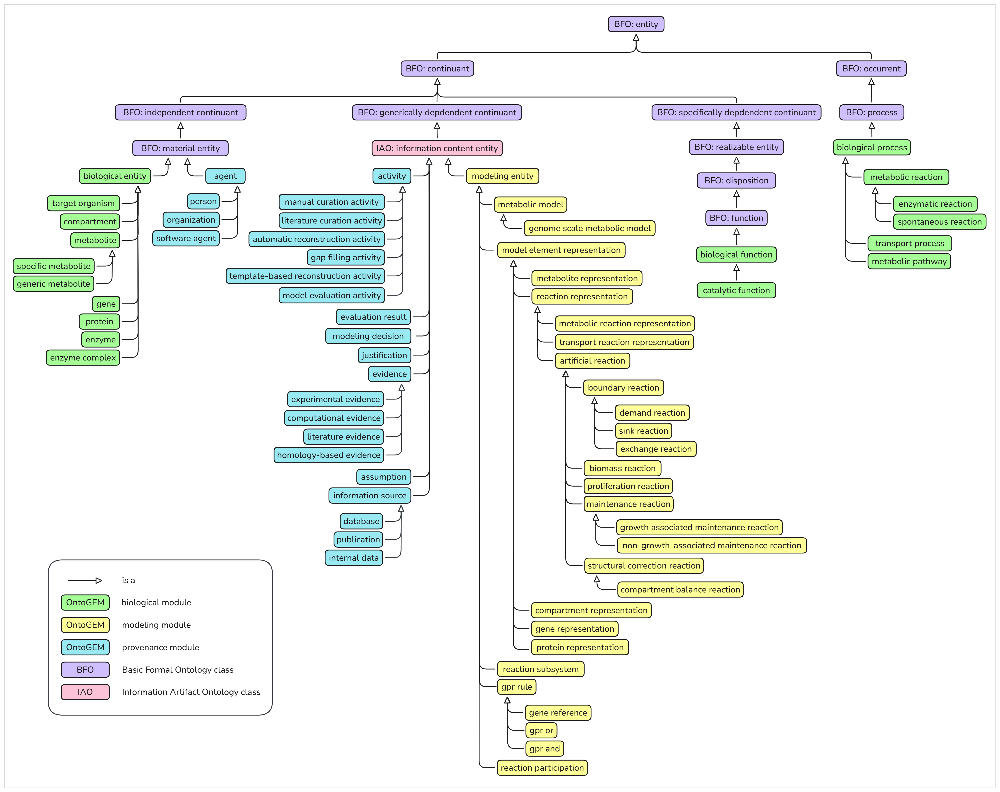

# OntoGEM Classes

## Class Hierarchy

The following diagram provides a visual overview of the class hierarchy defined in OntoGEM.

OntoGEM classes are organized into three complementary modules, each representing a distinct conceptual perspective of genome-scale metabolic models:

* **Biological Module** - defines biological entities and processes that exist independently of a computational model and that may be represented in a metabolic model.

* **Modeling Module** - defines the computational representations of biological knowledge within a metabolic model, including model elements and their associated representations.

* **Provenance Module** - defines entities and concepts used to represent the provenance, evidence, assumptions, modeling decisions, and reconstruction and curation activities associated with the model and its representations.

This modularization separates **biological reality**, **model representation**, and **provenance and epistemic context**, while allowing the modules to be connected through explicit relationships.

## Biological Module

| **Class (Preferred Label)** | **Definition** | **Parent (Direct superclass)** | **Rationale** | **Related Ontology Terms** |
| --- | --- | --- | --- | --- |
| *biological entity* | A material entity that exists as part of a biological system independently of any computational representation. | `bfo: material entity` | Provides a common superclass for all biological entities represented in OntoGEM. | `uberon: anatomical entity` (included in COB) |
| *target organism* | A living biological system whose metabolism is being represented or modeled. | `ontogem: biological entity` | - | `cob: organism` |
| *compartment* | A spatially defined region within or around a cell where biological entities are localized. | `ontogem: biological entity` | - | `go: cellular anatomical structure` (included in uberon); `go: cellular anatomical entity` (GO synonym used in cob) |
| *metabolite* | A small molecule participating in biochemical processes within a biological system. | `ontogem: biological entity` | - | `cob:molecule` |
| *specific metabolite* | A metabolite that has a precisely defined chemical structure. | `ontogem: metabolite` | Distinguishes metabolites with a precisely defined chemical identity from more generic metabolite concepts (e.g., palmitate vs. generic fatty acid). | - |
| *generic metabolite* | A metabolite that represents a class of structurally related molecules without specifying a single exact chemical structure. | `ontogem: metabolite` | Introduced to represent metabolites that are intentionally modeled at a higher level of abstraction, reflecting the fact that GEMs and biological databases sometimes use generic compounds rather than fully specified chemical entities. | - |
| *gene* | A unit of biological information with a physical basis in a nucleotide sequence of DNA (or RNA in some viruses) that specifies one or more functional products, generated through transcription and, when applicable, translation. | `ontogem: biological entity` | - | - |
| *protein* | A macromolecule composed by a backbone of amino acids polymerized through peptidic bounds in a sequence encoded by a gene, and which may perform structural, regulatory, or catalytic functions. | `ontogem: biological entity` | Distinguishes proteins from enzymes by treating catalysis as a function rather than an identity. This allows proteins to exist independently of their catalytic roles and supports proteins with non-catalytic functions. | `pr:protein` (included in COB), `chebi:protein` |
| *enzyme* | A macromolecule (protein or RNA) that individually performs a catalytic function, sufficient on its own to catalyze a specific biochemical reaction. | `ontogem:biological entity` | Instances of this class are intended to be inferred rather than asserted explicitly. Any protein that bears a catalytic function is considered an enzyme. Other catalytic entities (e.g., ribozymes) are not explicitly represented in the current version because they rarely occur in GEMs. | `obi:enzyme` |
| *enzyme complex* | A set of two or more macromolecules (typically proteins) that cooperate to perform a catalytic function, where each individual protein contributes to but does not alone perform that function. | `ontogem: enzyme` | Introduced to represent multimeric enzymes as distinct biological entities. We intentionally distinguish enzyme complexes from more general protein assemblies, since not every set of interacting proteins forms a stable molecular complex. | `go: catalytic complex` (included in uberon, a subclass of `go:protein-containing complex`), `cob:complex of molecules` |
| *biological function* | A realizable property that inheres in a biological entity and specifies a capacity or activity that the entity is able to perform by virtue of its structure and organization, and that is typically realized in specific biological processes under appropriate conditions. | `bfo: function` (included in cob) | - | - |
| *catalytic function* | A biological function that enables an entity to accelerate a biochemical reaction without being consumed, typically by lowering activation energy. | `ontogem: biological function` | - | - |
| *biological process* | A process occurring in a biological system, involving one or more causally connected events and contributing to the functioning of a cell, organism, or biological system. | `bfo: process` | Provides a common superclass for all biological processes represented in OntoGEM. | - |
| *metabolic reaction* | A biochemical process in which metabolites are transformed through chemical reactions within a biological system. | `ontogem: biological process` | - | - |
| *enzymatic reaction* | A metabolic reaction that is catalyzed by at least one enzyme. | `ontogem: metabolic reaction` | - | - |
| *spontaneous reaction* | A metabolic reaction that occurs without enzymatic catalysis under physiological conditions. | `ontogem: metabolic reaction` | - | - |
| *transport process* | A biological process involving the movement of entities (e.g., ions, metabolites, proteins) within or between biological compartments. | `ontogem: biological process` | Named "transport process" rather than "transport reaction" because transport does not necessarily involve chemical transformation. Nevertheless, transport processes may still be catalyzed by enzymes. | `go:transport`, `sbo:transport reaction` |
| *metabolic pathway* | A biological process composed of multiple interconnected biochemical reactions contributing to a cellular function. | `ontogem: biological process` | Introduced to distinguish biological pathways from reaction subsystems. Metabolic pathways represent biological processes, whereas reaction subsystems are modeling constructs used to organize reaction representations. The two do not necessarily have a one-to-one correspondence. | `pw:pathway`, `pw:classic metabolic pathway` |

## Modeling Module

| **Class (Preferred Label)** | **Definition** | **Parent (Direct superclass)** | **Rationale** | **Related Ontology Terms** |
| --- | --- | --- | --- | --- |
| *modeling entity* | An entity that represents or describes knowledge involved in the representation, reconstruction, or curation of a metabolic model. | `iao: information content entity` | Provides a common superclass for all modeling entities represented in OntoGEM. | - |
| *metabolic model* | A modeling entity that represents biochemical processes and their associated biological entities for the purpose of computational analysis. | `ontogem: modeling entity` | Provides a level of abstraction to distinguish genome-scale metabolic models from other types of metabolic models. | - |
| *genome-scale metabolic model* | A metabolic model that represents the full or near-complete set of metabolic capabilities of a given organism at the genome scale. | `ontogem: metabolic model` | - | - |
| *model element representation* | An information content entity that represents an entity, process, or modeling construct as encoded for use in a metabolic model. | `ontogem: modeling entity` | Provides a common superclass for the representations of biological entities and processes used in metabolic models, allowing common attributes and relationships to be defined once. | - |
| *metabolite representation* | A model element representation that corresponds to a metabolite for use in a metabolic model. | `ontogem: model element representation` | Distinguishes the representation of a metabolite within a model from the biological metabolite itself, allowing model-specific attributes to be represented independently of biological knowledge. It also allows multiple representations of the same biological metabolite, including representations obtained from external sources and representations created by curators. | - |
| *reaction representation* | A model element representation that corresponds to a reaction or reaction-like modeling construct within a metabolic model. | `ontogem: model element representation` | Provides a common superclass for metabolic, transport, and artificial reaction representations without implying that every reaction representation corresponds directly to a biological process. | - |
| *metabolic reaction representation* | A reaction representation that corresponds to a biochemical transformation of metabolites within a metabolic model. | `ontogem: reaction representation` | - | - |
| *transport reaction representation* | A reaction representation that corresponds to the transport of metabolites between compartments within a metabolic model. | `ontogem: reaction representation` | Maintains the distinction between a transport process in the biological module and its representation in the modeling module. | - |
| *artificial reaction* | A reaction representation introduced for modeling purposes that does not directly correspond to a single biological process. | `ontogem: reaction representation` | Introduced to represent reactions that are required for model construction or simulation but do not correspond directly to biological processes. | `sbo: pseudoreaction` |
| *boundary reaction* | An artificial reaction representation that represents the interaction between the modeled metabolic system and its environment or boundary. | `ontogem: artificial reaction` | - | - |
| *demand reaction* | A boundary reaction that represents a demand for a metabolite within the modeled metabolic system, i.e., the irreversible consumption of a metabolite at the boundary of the modeled system without specifying its downstream use. | `ontogem: boundary reaction` | - | `sbo: demand reaction` |
| *sink reaction* | A boundary reaction that represents the reversible production or consumption of a metabolite at the boundary of the modeled system, allowing its supply to or removal from the system without specifying the underlying processes. | `ontogem: boundary reaction` | - | - |
| *exchange reaction* | A boundary reaction that represents the transfer of a metabolite between the modeled system and an external compartment corresponding to its environment. | `ontogem: boundary reaction` | - | `sbo: exchange reaction` |
| *biomass reaction* | An artificial reaction that represents the consumption of metabolites corresponding to biomass constituents in fixed proportions reflecting their fractional contributions to cellular biomass. | `ontogem: artificial reaction` | Introduced to represent biomass formation independently of the biological processes contributing to cellular growth. | biomass objective function |
| *proliferation reaction* | A biomass-related artificial reaction that represents the production of cellular biomass associated with organismal growth or proliferation, typically serving as part of the biomass objective function in a metabolic model. | `ontogem: artificial reaction` | Distinguishes reactions representing proliferation-related requirements from other artificial reactions, including maintenance reactions. | - |
| *maintenance reaction* | An artificial reaction that represents the consumption of energy metabolites to account for cellular processes necessary for cellular maintenance. | `ontogem: artificial reaction` | - | - |
| *growth associated maintenance reaction* | A maintenance reaction that represents the consumption of energy metabolites in proportion to biomass production. | `ontogem: maintenance reaction` | - | - |
| *non-growth-associated maintenance reaction* | A maintenance reaction that represents the consumption of energy metabolites independent of biomass production. | `ontogem: maintenance reaction` | - | - |
| *structural correction reaction* | An artificial reaction that is introduced to restore consistency, connectivity, or feasibility in a metabolic model by compensating for missing or incomplete biological knowledge. | `ontogem: artificial reaction` | - | - |
| *compartment balance reaction* | A structural correction reaction that ensures mass or charge balance across compartments in a metabolic model. | `ontogem: structural correction reaction` | - | - |
| *compartment representation* | A modeling entity that represents a spatial subdivision used to localize entities within a metabolic model. | `ontogem: model element representation` | Allows different representations of the same biological or physical compartment and supports source-specific or curator-created representations. | - |
| *gene representation* | A model element representation that represents a gene for use in a metabolic model, typically through an identifier or other symbolic encoding. | `ontogem: model element representation` | - | - |
| *protein representation* | A model element representation that represents a protein for use in a metabolic model, including information explicitly associated with the protein. | `ontogem: model element representation` | Supports the explicit representation of proteins, whose information is often implicitly encoded through genes in existing GEMs. | - |
| *reaction subsystem* | A modeling entity that groups reaction representations according to a functional or organizational criterion within a metabolic model. | `ontogem: modeling entity` | Introduced to distinguish model-specific reaction groupings from biological metabolic pathways, since the two do not necessarily correspond. | `sbo: subsystem` |
| *gpr rule* | A modeling entity representing the logical structure of gene-protein-reaction relationships. It specifies the gene requirements associated with a reaction representation in a genome-scale metabolic model. | `ontogem: modeling entity` | The rule is represented as a hierarchical expression composed of gene references and logical operators. | - |
| *gpr and* | A GPR rule that represents a logical conjunction between two or more GPR rules, indicating that multiple genes are jointly required, typically corresponding to components of an enzyme complex. | `ontogem: gpr rule` | - | - |
| *gpr or* | A GPR rule that represents a logical disjunction between two or more GPR rules, indicating that alternative genes (or gene sets) can independently support the reaction, typically corresponding to isozymes or alternative catalytic units. | `ontogem: gpr rule` | - | - |
| *gene reference* | A GPR rule that refers to a gene representation occurring as an element of a GPR rule. | `ontogem: gpr rule` | Represents a leaf node in the GPR rule structure and connects the logical rule to a gene representation. | - |
| *reaction participation* | A modeling entity that represents the participation of a metabolite representation in a reaction representation, including participation-specific information such as stoichiometry. | `ontogem: modeling entity` | Separates information about participation in a particular reaction from the metabolite representation itself, allowing participation-specific attributes such as stoichiometry to be represented. | - |

## Provenance Module

| **Class (Preferred Label)** | **Definition** | **Parent (Direct superclass)** | **Rationale** | **Related Ontology Terms** |
| --- | --- | --- | --- | --- |
| *agent* | An individual, software system, or organization responsible for performing one or more reconstruction or curation activities that generate modeling decisions. | `bfo: material entity` | - | `prov:agent` (also included in SEPIO) |
| *person* | An agent that is a human individual responsible for creating, evaluating, or revising modeling decisions, annotations, or supporting evidence. | `ontogem: agent` | - | `prov:person` (included in SEPIO) |
| *software agent* | An agent that is a computational system executing software to generate, infer, or apply modeling decisions or evidence. | `ontogem: agent` | - | `prov:software agent` (included in SEPIO) |
| *organization* | An agent that is a collective entity, such as an institution or research group, responsible for producing, maintaining, or disseminating data, tools, or models. | `ontogem: agent` | - | `prov:organization` (included in SEPIO) |
| *activity* | A reconstruction, curation, or evaluation process performed during the development, maintenance, or assessment of a genome-scale metabolic model. | `iao: information content entity` | - | `prov:activity` |
| *manual curation activity* | A reconstruction or curation activity in which modeling decisions are established primarily through human analysis and judgment. | `ontogem: activity` | - | - |
| *literature curation activity* | A manual curation activity in which modeling decisions are established primarily through the interpretation of information reported in scientific or technical literature. | `ontogem: activity` | - | - |
| *automatic reconstruction activity* | A reconstruction activity in which modeling decisions are generated primarily through automated computational procedures with minimal or no direct human intervention. | `ontogem: activity` | - | - |
| *gap filling activity* | A reconstruction activity that introduces or modifies model entities to restore or improve the ability of a metabolic model to satisfy specified computational objectives or constraints. | `ontogem: activity` | Explicitly represents gap-filling as a distinct reconstruction strategy, enabling queries about model elements introduced through computational gap-filling regardless of whether the activity was fully automated or involved human intervention. | - |
| *model evaluation activity* | An activity that evaluates one or more properties of a metabolic model or its components according to one or more specified criteria and produces one or more evaluation results. | `ontogem: activity` | Provides a representation of model assessment, supporting both whole-model and component-level evaluation. | - |
| *template-based reconstruction activity* | A reconstruction activity that generates modeling decisions by transferring or adapting knowledge from one or more existing metabolic models or reconstruction templates. | `ontogem: activity` | Explicitly represents reconstruction based on existing models, enabling the provenance of transferred or adapted knowledge to be distinguished from de novo reconstruction and other computational approaches. | - |
| *evaluation result* | An information content entity that records the outcome of a model evaluation according to a specified evaluation criterion. | `iao: information content entity` | Provides an explicit representation of the results produced by model evaluation activities, allowing evaluation outcomes, scores, and other assessment findings to be traced to the activity and criterion that produced them. | - |
| *modeling decision* | An adopted decision concerning how a modeling entity is created or modified in a genome-scale metabolic model. | `iao: information content entity` | Represents adopted modeling decisions as reified entities, allowing decision-specific information such as confidence and justification to be represented explicitly. | - |
| *justification* | The adopted line of reasoning that explains why a modeling decision was made. A justification combines the evidence and assumptions considered sufficient to support a modeling decision. | `iao: information content entity` | Introduced to distinguish the reasoning supporting a modeling decision from the individual pieces of evidence and assumptions on which it is based. | - |
| *evidence* | An observation, result, or accepted piece of knowledge that supports a justification. Evidence provides the factual basis for a modeling decision and is obtained from one or more information sources. | `iao: information content entity` | - | `eco: evidence?` |
| *experimental evidence* | Evidence derived from observations, measurements, experiments, or experimentally determined biological or biochemical data. | `ontogem: evidence` | - | - |
| *computational evidence* | Evidence generated or obtained through computational analysis, prediction, simulation, or inference. | `ontogem: evidence` | - | - |
| *literature evidence* | Evidence obtained from information reported in scientific publications or other scholarly literature. | `ontogem: evidence` | - | - |
| *homology-based evidence* | Evidence supporting a modeling decision based on knowledge about a homologous or biologically related organism, model, or biological entity. | `ontogem: evidence` | Enables the explicit representation and querying of evidence transferred from homologous or biologically related organisms, a common strategy in genome-scale metabolic model reconstruction. | - |
| *assumption* | A premise accepted during reconstruction or curation that enables the interpretation of evidence or supports an inference. Assumptions represent biological or methodological principles that are adopted to justify modeling decisions. | `iao: information content entity` | Introduced to explicitly represent biological and methodological premises that influence modeling decisions but are not themselves evidence. | - |
| *information source* | An information artifact from which evidence is obtained. Information sources identify the origin of the knowledge used to justify modeling decisions. | `iao: information content entity` | - | - |
| *database* | An information source that provides structured records of biological, biochemical, genomic, or modeling knowledge. | `ontogem: information source` | - | `sio: database`, `sio: dataset` |
| *publication* | An information source consisting of a scientific or technical publication containing information relevant to a modeling decision. | `ontogem: information source` | - | `sio: publication` |
| *internal data* | An information source consisting of data generated, collected, or maintained within the reconstruction or curation context and not necessarily disseminated through an external information resource. | `ontogem: information source` | Allows evidence derived from laboratory data, internal datasets, project records, or other locally maintained resources to be distinguished from externally published or database-derived information. | - |

## Ontology Prefixes and Abbreviations

The following prefixes and abbreviations are used throughout this document to refer to external ontologies and semantic resources.

| **Prefix** | **Ontology / Resource** | **BioPortal Link** |
| --- | --- | --- |
| `bfo` | Basic Formal Ontology | https://bioportal.bioontology.org/ontologies/BFO |
| `pr` | Protein Ontology | https://bioportal.bioontology.org/ontologies/PR |
| `cob` | Core Ontology for Biology and Biomedicine | https://bioportal.bioontology.org/ontologies/COB |
| `uberon` | Uber Anatomy Ontology | https://bioportal.bioontology.org/ontologies/UBERON |
| `iao` | Information Artifact Ontology | https://bioportal.bioontology.org/ontologies/IAO |
| `go` | Gene Ontology | https://bioportal.bioontology.org/ontologies/GO |
| `pw` | Pathway Ontology | https://bioportal.bioontology.org/ontologies/PW |
| `chebi` | Chemical Entities of Biological Interest | https://bioportal.bioontology.org/ontologies/CHEBI |
| `obi` | Ontology for Biomedical Investigations | https://bioportal.bioontology.org/ontologies/OBI |
| `prov` | Provenance Ontology | https://bioportal.bioontology.org/ontologies/PROVO |
| `eco` | Evidence and Conclusion Ontology | https://bioportal.bioontology.org/ontologies/ECO |
| `sepio` | Scientific Evidence and Provenance Information Ontology | https://bioportal.bioontology.org/ontologies/SEPIO |
| `sio` | Semanticscience Integrated Ontology | https://bioportal.bioontology.org/ontologies/SIO |

