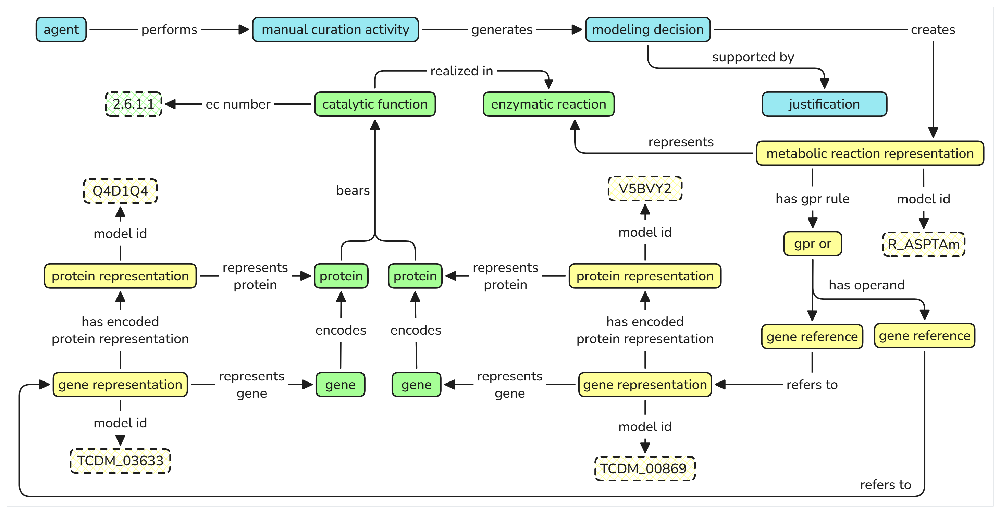
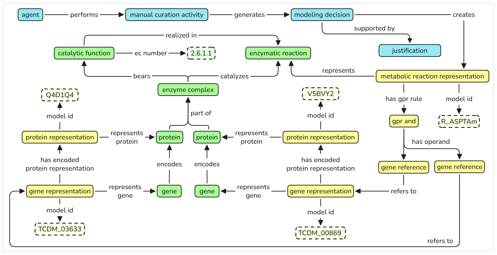

## GPR Representation Example

The following diagram shows a partial representation of the *Aspartate transaminase* reaction, focusing on its GPR association, extracted from the *Trypanosoma cruzi* model iIS312 (Shiratsubaki et al., 2020) and represented using OntoGEM.

**GPR Rule:** `TCDM_03633 OR TCDM_00869`

For comparison, a second example illustrates the representation of a GPR AND rule. This example was created by adapting the original reaction above and replacing the OR operator with an AND operator.

**GPR Rule:** `TCDM_03633 AND TCDM_00869`

